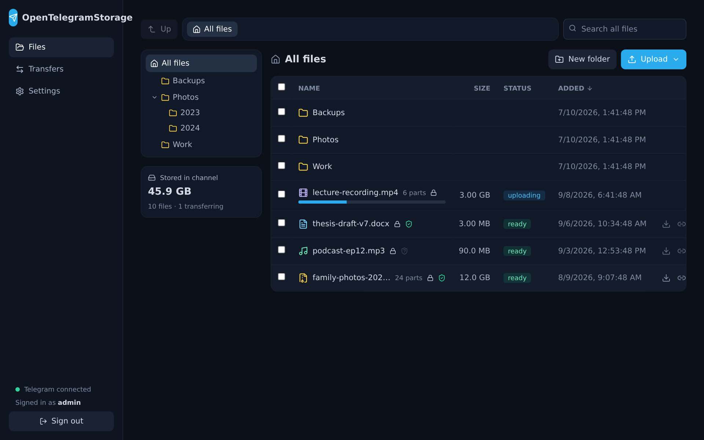
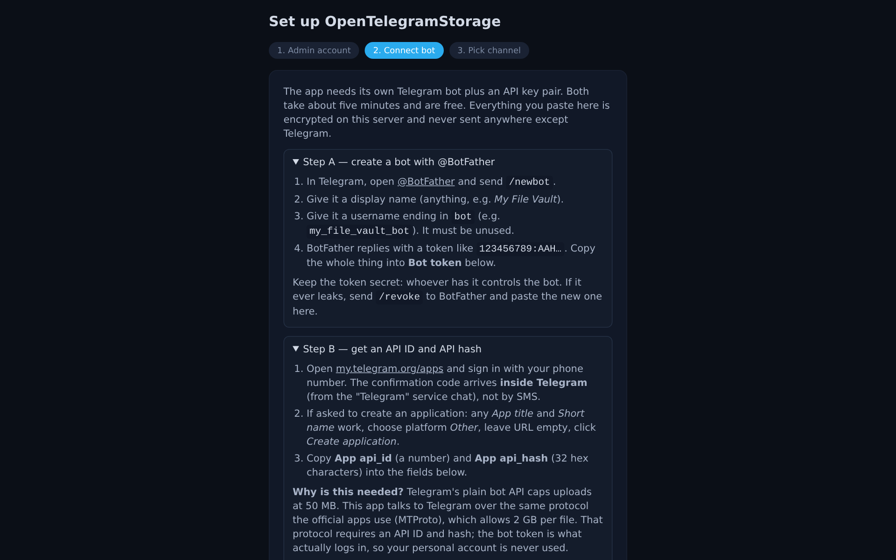
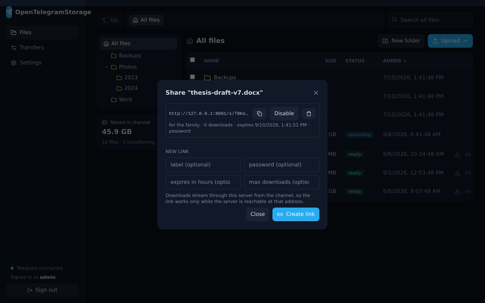

<p align="center">
  
</p>

<h1 align="center">OpenTelegramStorage</h1>

<p align="center">
  Self-hosted, encrypted file storage that keeps the bytes in your own private Telegram channel.<br>
  Unlimited space, files of any size, a normal web UI, one Docker container.
</p>

<p align="center">
  <a href="https://github.com/Smileyface101/OpenTelegramStorage/actions/workflows/ci.yml"></a>
  <a href="https://github.com/Smileyface101/OpenTelegramStorage/pkgs/container/opentelegramstorage"></a>
  <a href="LICENSE"></a>
</p>

---

Telegram lets a bot keep files of up to 2 GB per message in a channel, forever,
for free. OpenTelegramStorage turns that into a storage service you run
yourself: drop files or whole folders in a browser, and the app streams them
into your channel in encrypted parts, keeps an index, and streams them back
out on demand. Your server never holds more than a few parts on disk.

## Why you might want this

| You get | The honest trade-offs |
|---|---|
| No storage bill and no quota | Your server must be online for downloads |
| Files of any size (split automatically) | A few MB/s per connection; a 10 GB file takes minutes, not seconds |
| Encrypted before it leaves your machine | Telegram may throttle accounts that push huge volumes |
| Real deletion, integrity checks, share links, folder zips | No native mobile app; the web UI works on phones |
| Rebuild everything from the channel alone | Not a replacement for a backup you cannot afford to lose |

Telegram is not a storage product and its terms are not written for one.
This project is for personal use with your own bot and your own channel.

## Quick start

You need three things from Telegram, all free, all in about five minutes.
The setup wizard walks you through them step by step:

1. A **bot token** from [@BotFather](https://t.me/BotFather) (`/newbot`).
2. An **API id and hash** from [my.telegram.org/apps](https://my.telegram.org/apps).
3. A **private channel** with the bot added as an administrator.

Then run the app. With Docker:

```bash
git clone https://github.com/Smileyface101/OpenTelegramStorage.git
cd OpenTelegramStorage
docker compose up -d          # or: docker-compose up -d   (older Docker)
```

Open <http://localhost:8080>, create the admin account, paste the credentials,
pick the channel, and start dropping files.

<p align="center"></p>

**Windows without Docker:** download `OpenTelegramStorage-windows-x64.zip`
from the [releases page](https://github.com/Smileyface101/OpenTelegramStorage/releases),
unzip, run `install.cmd`. It contains Python and everything else; nothing to
install first. Details in `scripts/windows/`.

Port taken? Set `OTS_PORT=8090` in a `.env` file next to `docker-compose.yml`.
Prefer a prebuilt image? `ghcr.io/smileyface101/opentelegramstorage:latest`
is published from every release; the compose file uses it and falls back to
building locally.

## Features

- **Any size.** Files above the part size (default 512 MB, max 1990 MB) are
  split into numbered parts, one channel message each, and joined again when
  you download. Folders can go up as one streamed zip or as a tree.
- **Fast and resumable.** Chunks upload several at a time; completed parts go
  to Telegram while the rest is still arriving; an interrupted upload resumes
  with only the missing chunks, even after a browser restart. Files over
  10 MB are pushed over several Telegram connections at once.
- **Encrypted.** New uploads are encrypted on your server before they reach
  Telegram (AES-256-GCM). Downloads, ranged downloads, verification and share
  links decrypt on the fly. Can be switched off.
- **Verified.** The browser and the server hash every file independently and
  must agree; each part is checked against its hash when it streams back out;
  **Verify** re-reads a file from the channel to prove it is still intact.
- **Organised.** Folders, drag-and-drop moves, sorting, search, file-type icons.
- **Shareable.** Public links per file with optional expiry, download cap and
  password. Recipients need no account.
- **Recoverable.** Every part carries a JSON caption describing its file, so
  the whole index can be rebuilt from the channel on a new machine.
- **Import in place.** Mount a directory and send files from it without a
  browser or a copy.
- **Shared workspaces.** Several servers can use the same bot and channel.
  Choose "shared" in the setup wizard and files uploaded from any of them
  appear on all of them within seconds, deletions, renames and moves
  propagate, and a server that was offline catches up on restart.
- **Locked down.** Password login with lockout, optional two-factor (TOTP)
  with recovery codes, per-device session list, admin-managed users who only
  see their own files, credentials and content key encrypted at rest.
- **Operable.** System panel with Telegram, worker, queue, staging and disk
  state plus recent errors; automatic cleanup of abandoned uploads; automatic
  Telegram reconnect.

<p align="center"></p>

## Backups and recovery

Three things matter. Everything else is rebuildable.

| What | Where | If lost |
|---|---|---|
| **Content key** | Settings → Content encryption → Export key | Every encrypted file becomes unreadable. Export it once and keep it with your passwords. |
| **The channel** | Telegram | Everything is gone. Never delete it; never make it public. |
| **Data volume** | Docker volume `ots-data` (or `OTS_DATA_DIR`) | Only the index and settings. Recover as below. |

Recovery on a new machine, or after losing the data volume:

1. Start a fresh install and create the admin account.
2. Settings → Content encryption → **Import key**, paste the exported key.
3. Settings → Telegram: connect the same bot and pick the same channel.
4. Settings → Recovery → **Rebuild index from channel**. Files, parts and
   folder paths come back; anything with missing parts is listed as failed
   with a reason.

The master key in `data/master.key` protects the credentials and the content
key inside the database. If you set `OTS_MASTER_KEY` instead, back that up
too; without either, the settings table cannot be decrypted, which is why
exporting the content key separately is the safe habit.

## Running behind a domain

The app speaks plain HTTP on port 8000 inside the container. To expose it:

1. Put Caddy, nginx or Cloudflare in front of it with TLS.
2. Set `OTS_TRUSTED_PROXY_COUNT` to the number of proxies (1 for a single
   reverse proxy, 2 for Cloudflare → nginx) so rate limiting and session IPs
   see the real client.
3. Set `OTS_COOKIE_SECURE=true`.
4. In Settings → Transfers, set the **public URL** so share links point at
   your domain.

Turn on two-factor authentication for every account before exposing it.

## Running without Docker

```bash
cd backend
python3 -m venv .venv && .venv/bin/pip install -r requirements.txt
OTS_DATA_DIR=../data .venv/bin/alembic upgrade head
OTS_DATA_DIR=../data .venv/bin/uvicorn main:app --port 8000

cd ../frontend
npm install && npm run build      # served by the backend from frontend/dist
```

For frontend development, `npm run dev` proxies `/api` to port 8000.

## Configuration

Environment variables (compose reads them from `.env`):

| Variable | Default | Meaning |
|---|---|---|
| `OTS_PORT` | `8080` | Host port (compose only) |
| `OTS_DATA_DIR` | `./data` (`/data` in Docker) | Database, master key, staging |
| `OTS_MASTER_KEY` | generated | 64 hex chars; overrides `data/master.key` |
| `OTS_IMPORT_DIR` | `data/import` (`/import` in Docker) | Directory for server-side import |
| `OTS_TRUSTED_PROXY_COUNT` | `0` | Reverse proxies in front of the app |
| `OTS_COOKIE_SECURE` | auto | Force the Secure cookie flag |
| `OTS_DEFAULT_PART_SIZE_MB` | `512` | Initial part size |
| `OTS_UPLOAD_CHUNK_SIZE` | `8388608` | Browser→server chunk in bytes; do not change while uploads are in flight |
| `OTS_LOG_LEVEL` | `INFO` | Log level |

Settings in the UI (admin): part size, parallel upload connections, retry
count, stale-upload cleanup age, public URL, encrypt new uploads.

Staging needs free disk for about four parts, 2 GB at the default part size;
uploads are refused below that.

## FAQ

**Is 2 GB the limit for a file or a folder?**
Neither. 2 GB is Telegram's limit for one message. Files and folder archives
are split into parts, so the only limit is your channel.

**Where is the zip built?**
Nowhere. The archive is written straight into the part pipeline as members
arrive; it never exists on disk as a whole. That is also why archives are
store-only: compressed sizes cannot be planned ahead.

**Why does Chrome show a dialog when I pick a folder?**
Every browser asks once before a page may read a folder. On Chromium the app
uses the newer picker, which shows a shorter "view files" prompt. Dragging a
folder from your file manager onto the page shows no prompt at all.

**Does delete really delete?**
Yes. Deleting a file deletes its messages from the channel, not just the
index row. Deleting a folder does this for everything inside.

**What if my bot token leaks?**
Whoever has it can read the channel. If encryption was on, they get
ciphertext; they can still delete messages. Revoke the token in BotFather,
paste the new one in Settings, and consider a fresh channel.

**Can two servers share one channel?**
Yes. Install the second one, enter the same bot credentials, pick the same
channel, answer "yes" to the sharing question, and import the content key
if encryption is on. Uploads, deletions, renames, moves and folder changes
sync both ways; give every server a different name.

**Can I use an existing channel?**
Yes, but every upload becomes a message in it, so a dedicated private channel
is tidier. Never make the channel public.

**How fast is it?**
Bound by Telegram. One connection manages a few MB/s; the app opens several
for files over 10 MB. Uploads overlap with the browser transfer, so total
time is roughly the slower of the two hops.

## Development

```bash
cd backend && pip install -r requirements-dev.txt && pytest
cd frontend && npm install && npm run build
```

The tests use a fake Telegram client; nothing in CI talks to Telegram.
[docs/architecture.md](docs/architecture.md) explains the pipeline, the part
and caption formats, the archive layout and the encryption scheme.
See [CONTRIBUTING.md](CONTRIBUTING.md) and [SECURITY.md](SECURITY.md).

## License

[MIT](LICENSE).
